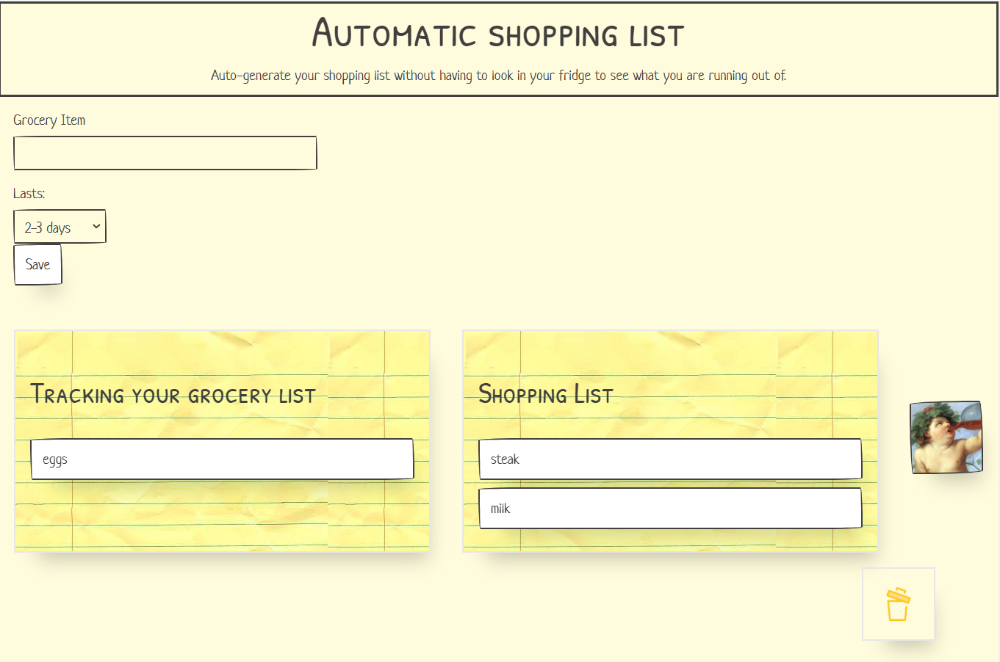

# Automated Shopping List

## This is an automated shopping list that alerts you without you having to check your fridge for what you need. You simply put an item on the list and an estimated time of how long it lasts you. Near the end of your selected duration of the item, items will automatically be added to your shopping list. You also have the option to manually add items from the tracking list to the active shopping list, as well as deleteing items you may not need anymore.

## Additionally, once items are in the shopping list, and API call returns the best wines that pair well with each item. The user can see suggestions from "The god of wine" based on what is in their shopping list. The user can also click on each item to get some of its nutrition facts (cal, fat, carbs).

### Technologies used:

- HTML
- CSS
- JavaScript
- PaperCSS
- MomentJS
- 2 Server-side APIs (Spoonacular, Edamam)

### Team:

- Rayell McMahan
- Tho Dang
- Jay Chen
- Sergey Grigoryev
  
